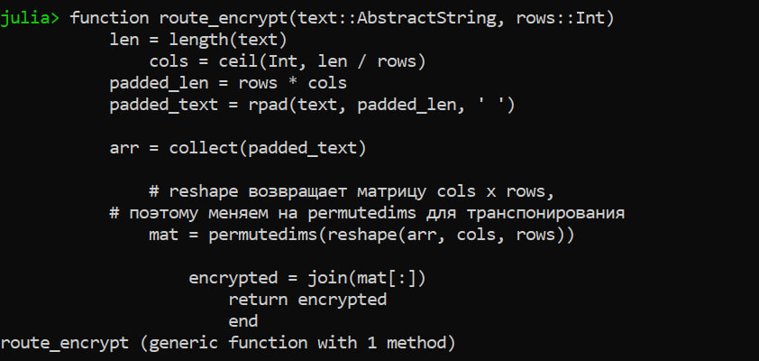
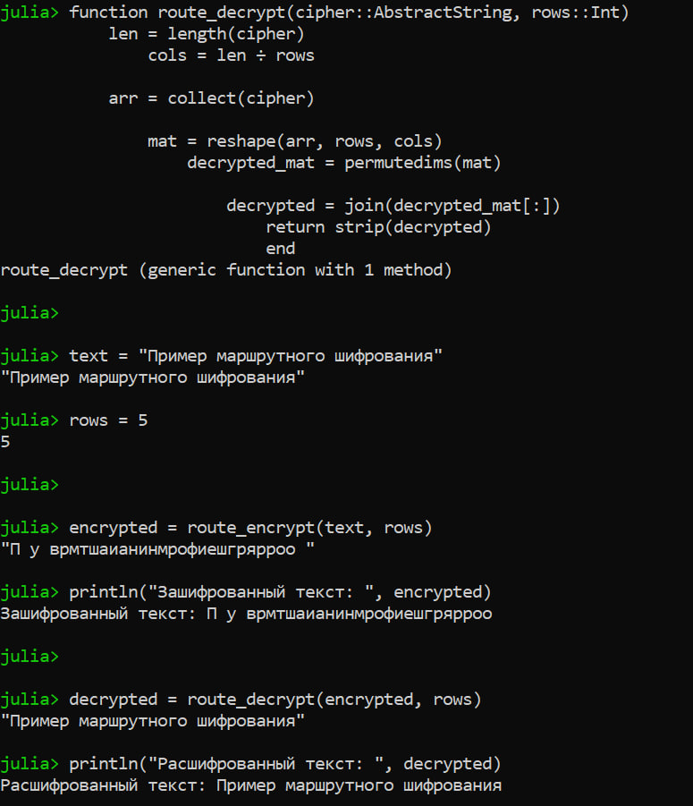
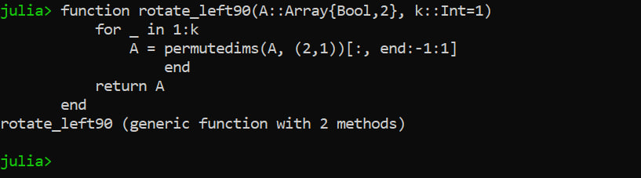
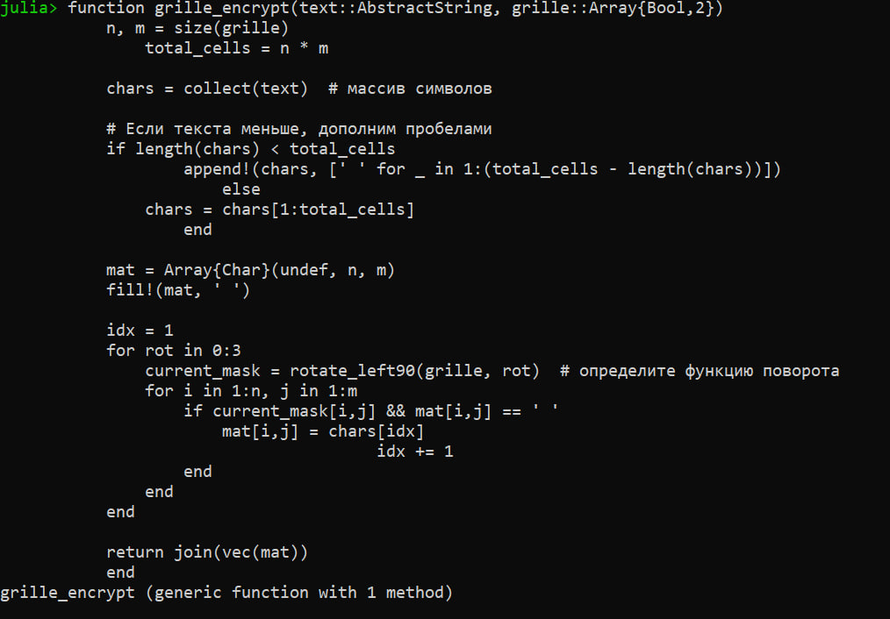
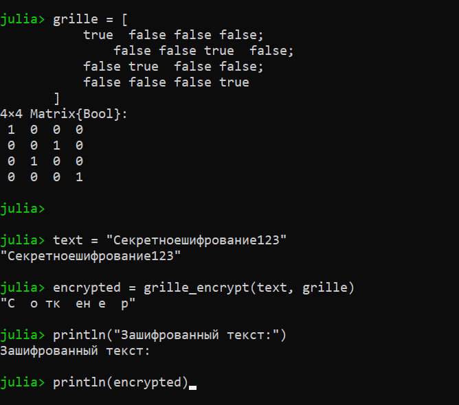

# Лабораторная работа №2: Шифры перестановки"
### Дисциплина: Математические основы защиты информации и информационной безопасности"
***Савченко Елизавета Николаевна, НПИмд-01-24, 1132249569***
**Российский университет дружбы народов, Москва, Россия**

27 сентября 20251

## Цель работы

Ознакомиться с классическими примерами шифров перестановки.

## Задание

1. Реализовать шифры, представленные в задании.

# Теоретическое введение

## Виды шифров
Шифры подразделяются на:

- Симметричные;
- Асимметричные.

## Виды симметричных шифров

Среди симметричных шифров выделяют:

- Шифры перестановки;
- Шифры подстановки.

# Выполнение лабораторной работы

## Реализация маршрутного шифрования (1)

## Реализация маршрутного шифрования (2)

## Результат работы кода для маршрутного шифрования

## Реализация шифрования с помощью решёток (1.1)

## Реализация шифрования с помощью решёток (1.2)

## Результат работы кода для шифрования с помощью решёток

## Реализация таблиц Виженера (1)

## Реализация таблиц Виженера (2)

## Результат работы кода для таблиц Виженера

# Выводы по проделанной работе

## Вывод

В результате работы мы ознакомились с традиционными моноалфавитными шрифтами простой замены, а именно: 

- Маршрутным шифрованием;
- Шифрованием с помощью решёток;
- Таблицами Виженера.

Были записаны скринкасты:

- выполнения лабораторной работы;
- создания отчёта по результатам выполения лабораторной работы;
- создания презентации по результатам выполнения лабораторной работы;
- защиты лабораторной работы.