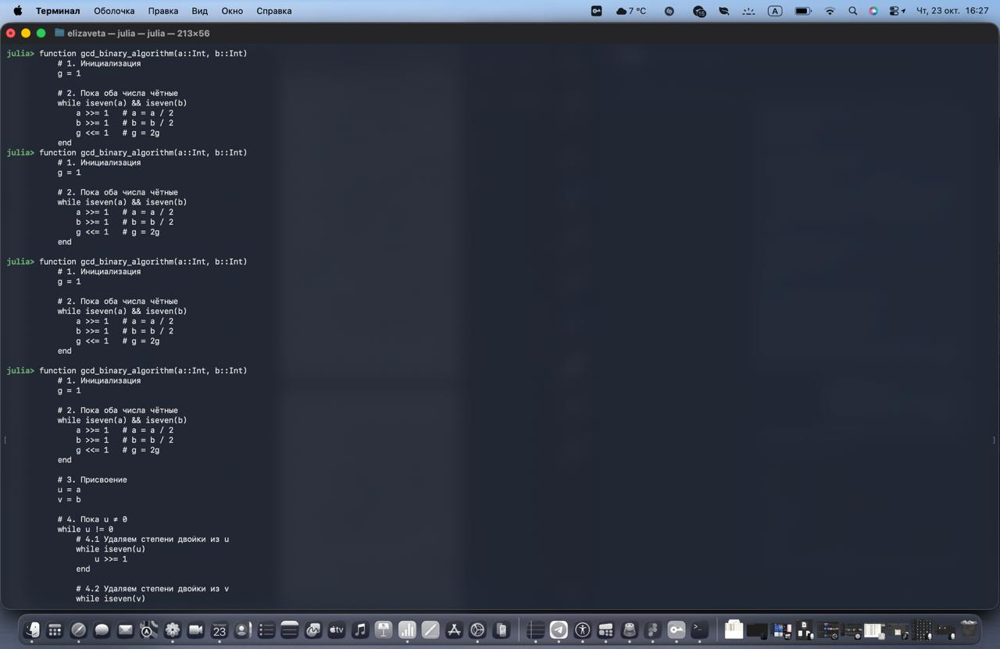
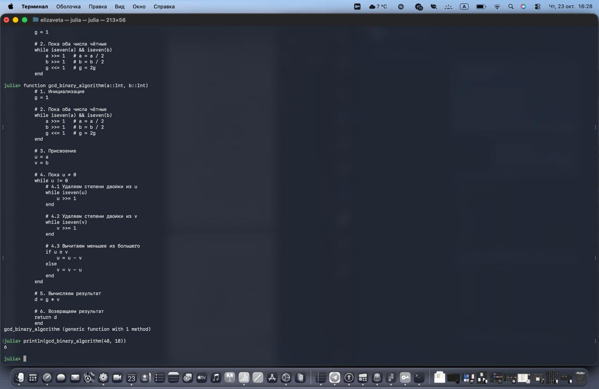

***Савченко Елизавета Николаевна, НПИмд-01-24, 1132249569***
**Российский университет дружбы народов, Москва, Россия**

25 октября 2025

# Общая информация о лабораторной работе

## Цель работы

Выполнить лаборатнорную работу 4 и изучить алгоритмы вычисления наибольшего общего делителя.

## Задание

Реализовать все рассмотренные алгоритмы программно.

# Теоретическое введение 

## Алгоритм Евклида

Основан на принципе, что НОД двух чисел a и b равен НОД числа b и остатка от деления a на b. Формально:

- НОД(a, b) = НОД(b, a mod b)
- Процесс повторяется, пока остаток не станет 0.
- Тогда НОД равен последнему ненулевому делителю.

## Бинарный алгоритм Евклида

Также известен как алгоритм на основе сдвигов. Использует свойства двоичной арифметики:

- Если оба числа чётные, НОД(a, b) = 2 × НОД(a/2, b/2)
- Если одно число чётное, другое нечётное, делим чётное на 2 (сдвигаем вправо)
- Если оба нечётные, заменяем большее число на разность с меньшим
- Повторяем, пока числа не сравняются

Преимущество — отсутствие операций деления и взятия остатка, что ускоряет вычисления на двоичных системах.

## Расширенный алгоритм Евклида

Помимо вычисления НОД, позволяет найти коэффициенты x и y в уравнении:
a×x + b×y = НОД(a, b)
Коэффициенты важны для решения уравнений в целых числах (например, диофантовы уравнения), криптографии (например, для нахождения обратного по модулю числа).

## Расширенный бинарный алгоритм Евклида

Комбинирует идеи расширенного алгоритма и бинарного, используя двоичные операции для ускорения и одновременно вычисляя коэффициенты x, y, что полезно при работе с большими числами.

# Выполнение лабораторной работы 

## Алгоритм Евклида и Бинарный алгоритм Евклида

## Расширенный алгоритм Евклида

## Расширенный бинарный алгоритм Евклида

# Выводы

В результате работы мы смогли реализовать все рассмотренные алгоритмы программно с помощью Julia

Были записаны скринкасты:

- выполнения лабораторной работы;
- создания отчёта по результатам выполения лабораторной работы;
- создания презентации по результатам выполнения лабораторной работы;
- защиты лабораторной работы.