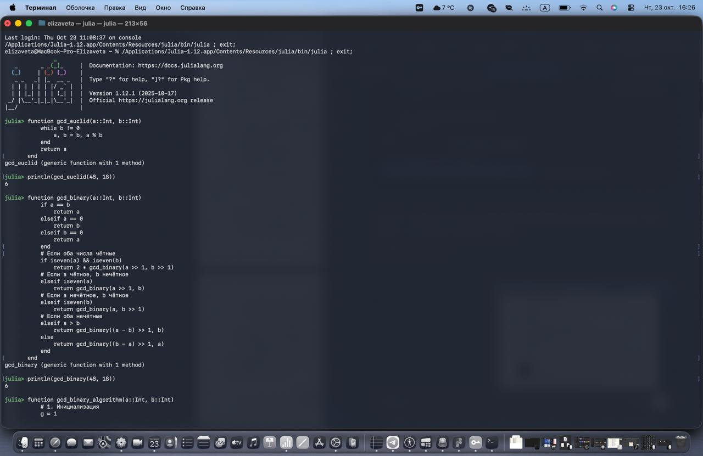
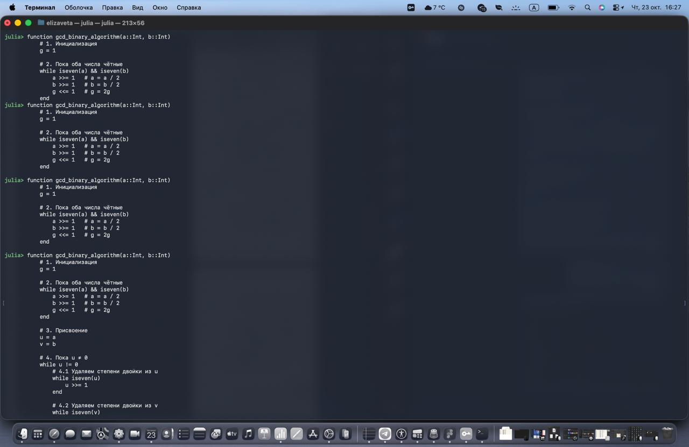
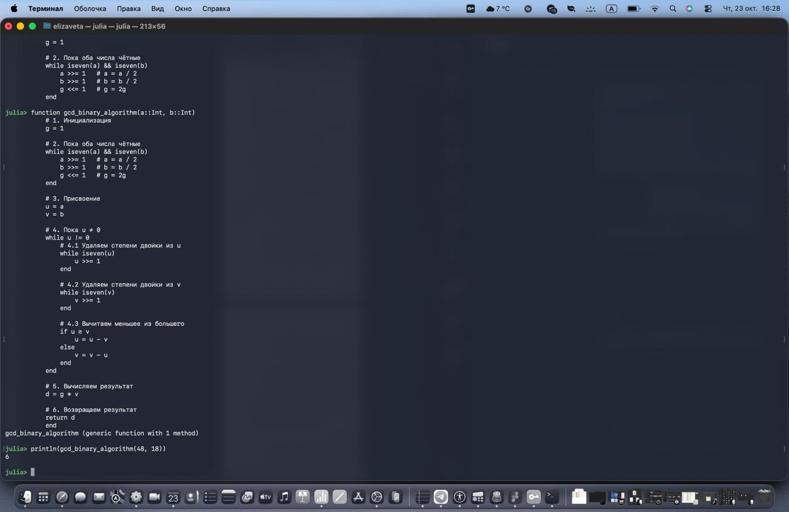

---
## Front matter
title: "Отчёт по лабораторной работе №4"
subtitle: "Дисциплина: Математические основы защиты информации и информационной безопасности"
author: "Савченко Елизавета Николаевна"

## Generic otions
lang: ru-RU
toc-title: "Содержание"

## Bibliography
bibliography: bib/cite.bib
csl: pandoc/csl/gost-r-7-0-5-2008-numeric.csl

## Pdf output format
toc: true # Table of contents
toc-depth: 2
lof: true # List of figures
lot: false # List of tables
fontsize: 12pt
linestretch: 1.5
papersize: a4
documentclass: scrreprt
## I18n polyglossia
polyglossia-lang:
  name: russian
  options:
	- spelling=modern
	- babelshorthands=true
polyglossia-otherlangs:
  name: english
## I18n babel
babel-lang: russian
babel-otherlangs: english
## Fonts
mainfont: IBM Plex Serif
romanfont: IBM Plex Serif
sansfont: IBM Plex Sans
monofont: IBM Plex Mono
mathfont: STIX Two Math
mainfontoptions: Ligatures=Common,Ligatures=TeX,Scale=0.94
romanfontoptions: Ligatures=Common,Ligatures=TeX,Scale=0.94
sansfontoptions: Ligatures=Common,Ligatures=TeX,Scale=MatchLowercase,Scale=0.94
monofontoptions: Scale=MatchLowercase,Scale=0.94,FakeStretch=0.9
mathfontoptions:
## Biblatex
biblatex: true
biblio-style: "gost-numeric"
biblatexoptions:
  - parentracker=true
  - backend=biber
  - hyperref=auto
  - language=auto
  - autolang=other*
  - citestyle=gost-numeric
## Pandoc-crossref LaTeX customization
figureTitle: "Рис."
tableTitle: "Таблица"
listingTitle: "Листинг"
lofTitle: "Список иллюстраций"
lotTitle: "Список таблиц"
lolTitle: "Листинги"
## Misc options
indent: true
header-includes:
  - \usepackage{indentfirst}
  - \usepackage{float} # keep figures where there are in the text
  - \floatplacement{figure}{H} # keep figures where there are in the text
---

# Общая информация о задании лабораторной работы

## Цель работы

Выполнить лаборатнорную работу 4 и изучить алгоритмы вычисления наибольшего общего делителя

## Задание 

1. Реализовать все рассмотренные алгоритмы программно.

# Теоретическое введение 

## Алгоритм Евклида

Основан на принципе, что НОД двух чисел a и b равен НОД числа b и остатка от деления a на b. Формально:

- НОД(a, b) = НОД(b, a mod b)
- Процесс повторяется, пока остаток не станет 0.
- Тогда НОД равен последнему ненулевому делителю.

## Бинарный алгоритм Евклида

Также известен как алгоритм на основе сдвигов. Использует свойства двоичной арифметики:

- Если оба числа чётные, НОД(a, b) = 2 × НОД(a/2, b/2)
- Если одно число чётное, другое нечётное, делим чётное на 2 (сдвигаем вправо)
- Если оба нечётные, заменяем большее число на разность с меньшим
- Повторяем, пока числа не сравняются

Преимущество — отсутствие операций деления и взятия остатка, что ускоряет вычисления на двоичных системах.

## Расширенный алгоритм Евклида

Помимо вычисления НОД, позволяет найти коэффициенты x и y в уравнении:
a×x + b×y = НОД(a, b)
Коэффициенты важны для решения уравнений в целых числах (например, диофантовы уравнения), криптографии (например, для нахождения обратного по модулю числа).

## Расширенный бинарный алгоритм Евклида

Комбинирует идеи расширенного алгоритма и бинарного, используя двоичные операции для ускорения и одновременно вычисляя коэффициенты x, y, что полезно при работе с большими числами.

# Выполнение лабораторной работы 

## Алгоритм Евклида и Бинарный алгоритм Евклида

## Расширенный алгоритм Евклида

## Расширенный бинарный алгоритм Евклида

# Выводы

В результате работы мы смогли реализовать все рассмотренные алгоритмы программно с помощью Julia

